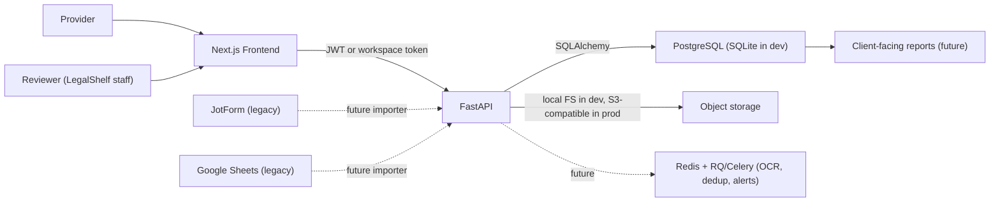

# Architecture

## Goal

A self-owned platform that migrates the historical JotForm + Google Sheets + human/legal review + Looker Studio operation to a controlled stack with PostgreSQL as the canonical source.

## Components

## Principles

- Regulation lives in `requirements` and `requirement_versions`. Never in form-only logic.
- Evidence lives as `submissions` + `documents`. Files stay out of the DB.
- Automation prevalidates *objective* signals only (PDF integrity, hash, deterministic keyword matches). Approval is always human.
- Every state transition records an `audit_log` event.
- Storage is environment-driven via `STORAGE_BACKEND`: `local` in dev, S3-compatible (R2 / S3 / GCS) in prod.

## Request flow — provider upload

1. Provider authenticates via workspace token in the portal.
2. Frontend wizard collects: vendor + period + institution + requirement code + the file itself.
3. `POST /api/v1/submissions` receives the multipart upload.
4. Backend writes the file to storage and computes SHA-256.
5. `submission`, `document`, and seed `validations` rows are written.
6. `services/pdf_validation` inspects the PDF (encryption, magic bytes, page count, text extraction).
7. `services/document_intelligence` runs deterministic signal checks (RFC, date, keyword matches).
8. Initial state lands as `pendiente_revision` or `posible_mismatch`.

## Request flow — reviewer decision

1. Reviewer logs in at `/admin/login` (JWT).
2. `/api/v1/reviewer/queue` returns submissions ordered by attention.
3. Reviewer opens detail at `/admin/reviewer/[submission_id]`.
4. Decision is one of: `approve`, `reject`, `request_clarification`, `mark_exception`.
5. `POST /api/v1/reviewer/{id}/decide` writes the new status + reviewer decision + audit event.

## Deployment targets (planned)

- Frontend → Vercel
- Backend → Render / Fly.io / Railway
- DB → Neon / Supabase / Railway Postgres
- Storage → Cloudflare R2 / AWS S3 / GCS
- Jobs → Redis + RQ or Celery (future, for OCR + dedup + alerts)
