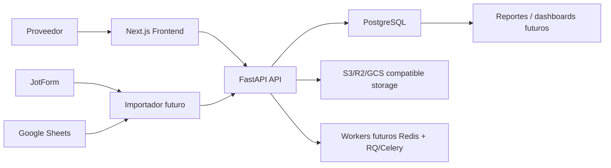

# Arquitectura CheckWise V1

## Objetivo

Crear una base técnica profesional para migrar gradualmente el flujo actual de JotForm + Google Sheets + revisión humana/legal + Looker Studio hacia una plataforma propia con PostgreSQL como fuente canónica.

## Componentes

## Principios

- La regulación vive en `requirements` y `requirement_versions`.
- La evidencia vive como `submissions` + `documents`.
- Los archivos viven fuera de la base de datos.
- La automatización inicial solo prevalida señales objetivas.
- La aprobación crítica queda en revisión humana.
- Todo cambio relevante se registra en `audit_log` o historial de estado.

## Flujo inicial

1. El proveedor o el operador captura una carga documental en el frontend.
2. El backend recibe campos estructurados y archivo.
3. El archivo se guarda en storage local de desarrollo, preparado para S3/R2/GCS.
4. Se calcula hash SHA-256 y metadatos técnicos.
5. Se registra `submission`, `document`, `validation` y `document_status_history`.
6. El estado inicial queda como `pendiente_revision`.

## Deployment previsto

- Frontend: Vercel.
- Backend: Render, Fly.io o Railway.
- DB: Neon, Supabase o Railway Postgres.
- Storage: Cloudflare R2, S3 o GCS.
- Jobs: Redis + RQ/Celery para OCR, deduplicación y alertas.
