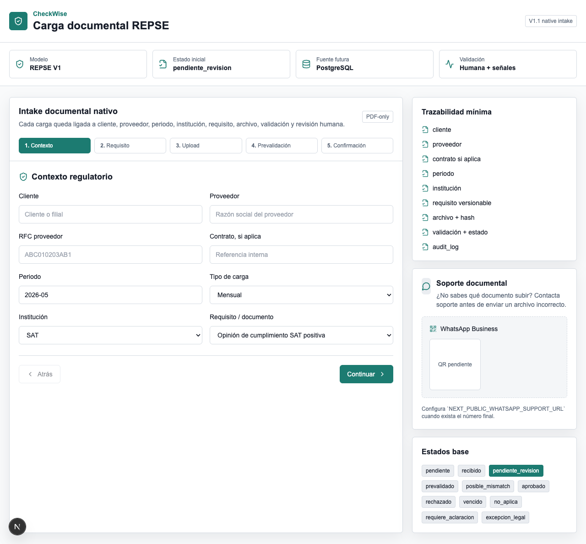
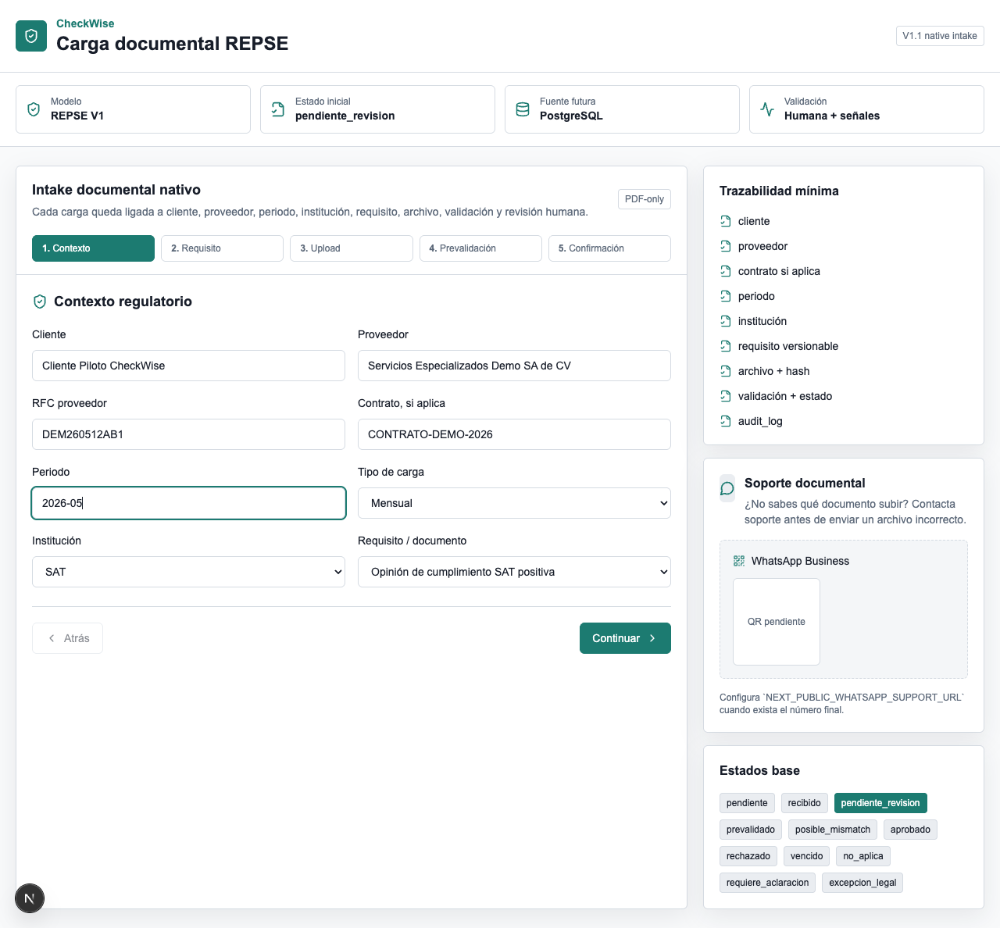
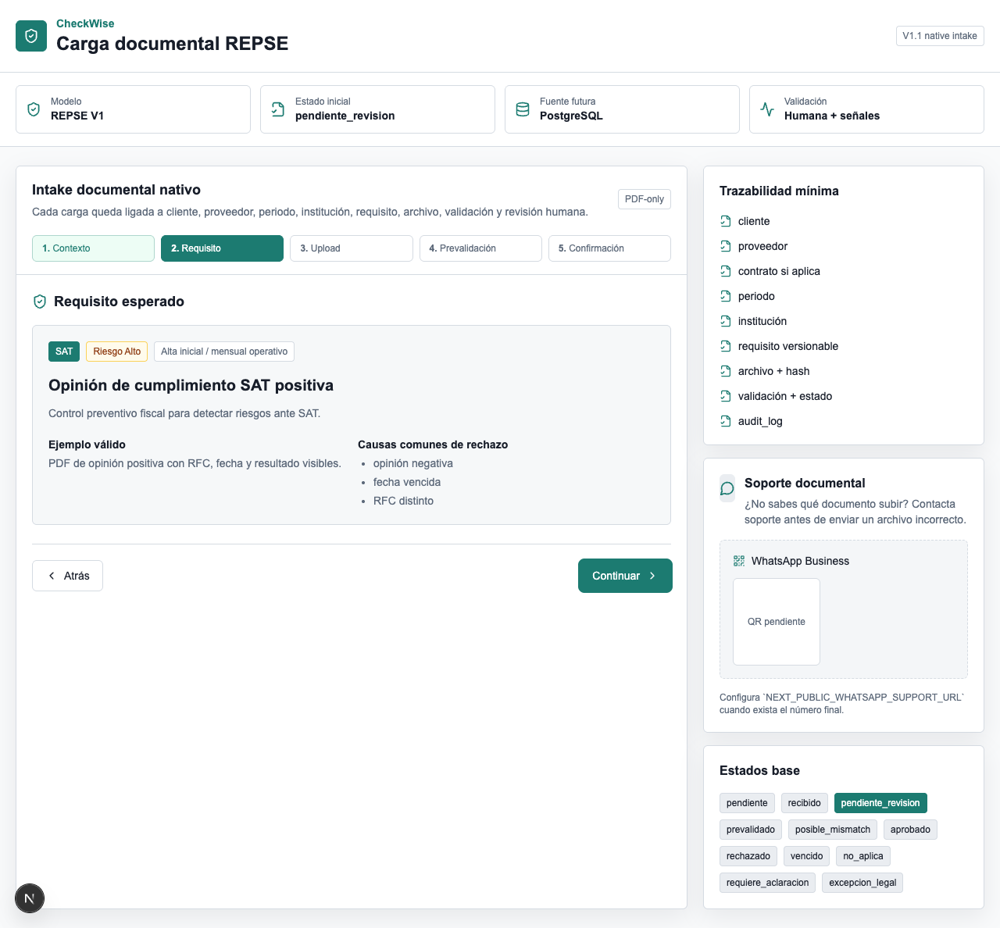
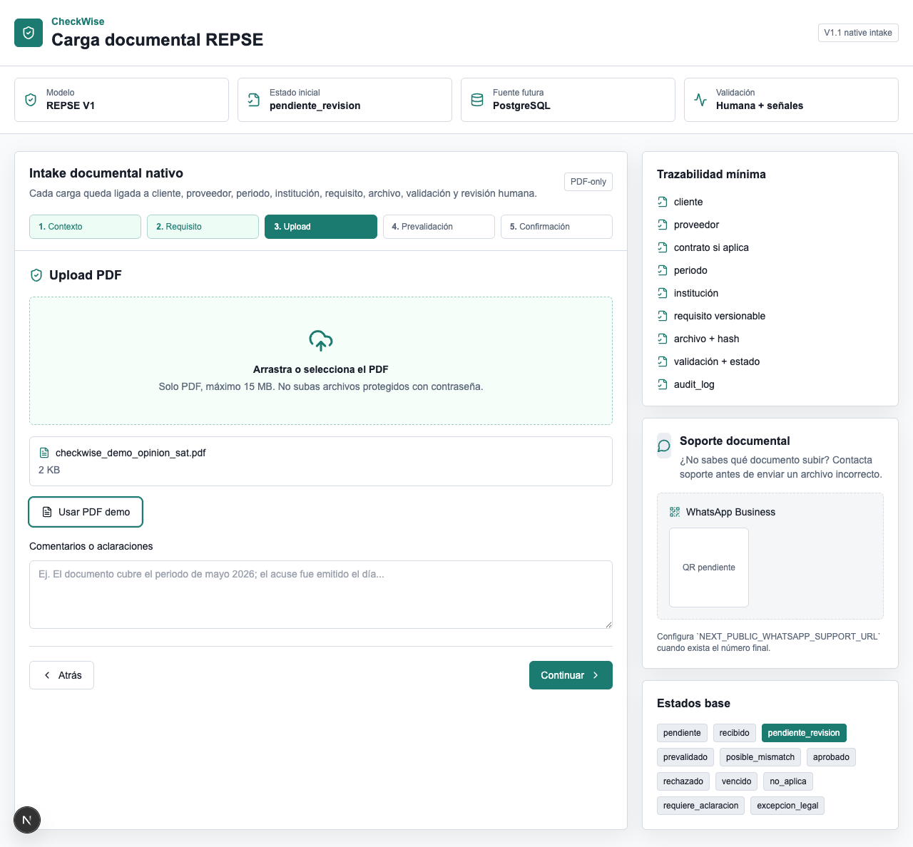
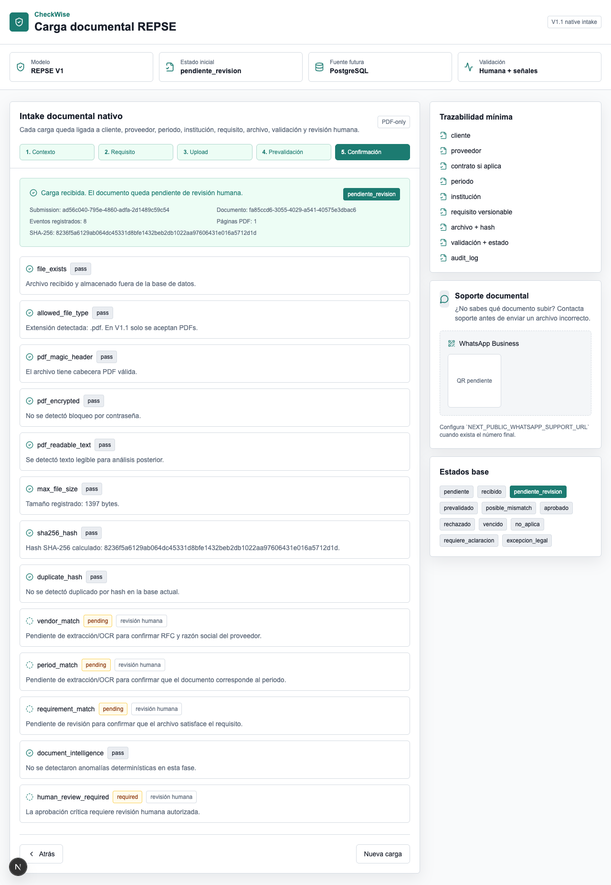
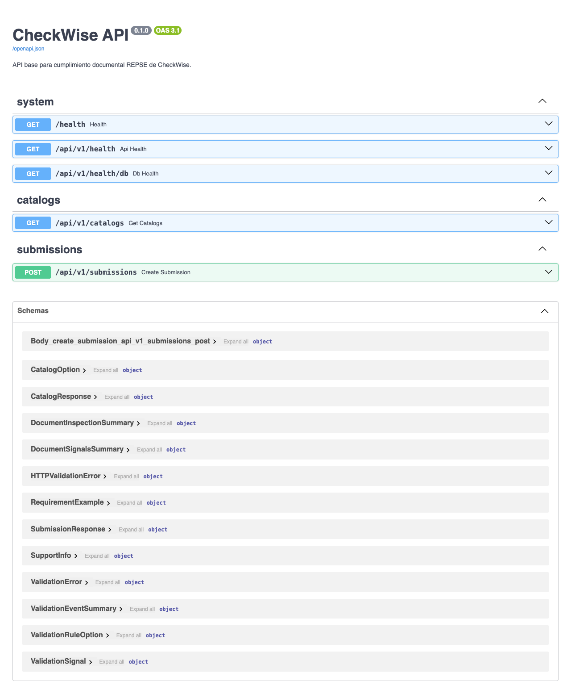

# CheckWise V1 Demo

## Trazabilidad documental REPSE

Esta guía prepara una demo honesta de CheckWise V1: una base técnica funcional para convertir una carga documental en evidencia trazable por cliente, proveedor, periodo, institución, requisito, archivo, validación, estado y revisión humana.

## Objetivo de la demo

Mostrar cómo CheckWise deja de tratar los documentos como archivos sueltos y los convierte en evidencia regulatoria organizada. La demo debe comunicar que el sistema ya tiene una base seria para migrar gradualmente desde JotForm, Google Sheets, revisión humana/legal y Looker Studio hacia PostgreSQL como fuente futura de verdad.

## Historia de usuario

Un proveedor carga un documento fiscal/REPSE correspondiente a un periodo. CheckWise relaciona esa evidencia con un cliente, proveedor, contrato si aplica, periodo, institución y requisito documental. El sistema guarda el archivo fuera de la base de datos, registra metadata, hash, señales de validación, estado documental y deja claro que la aprobación crítica sigue requiriendo revisión humana autorizada.

## Datos seguros de demo

- Cliente: `Cliente Piloto CheckWise`
- Proveedor: `Servicios Especializados Demo SA de CV`
- RFC proveedor: `DEM260512AB1`
- Periodo: `2026-05`
- Tipo de carga: `Mensual`
- Institución: `SAT`
- Requisito: `Opinión de cumplimiento SAT positiva`
- PDF: `demo_assets/sample_documents/checkwise_demo_opinion_sat.pdf`

El PDF es ficticio, no contiene datos reales sensibles y declara explícitamente que no tiene validez oficial.

## Flujo demo paso a paso

1. Abrir el frontend en `http://127.0.0.1:3000`.
2. Presentar el encabezado y explicar que CheckWise es una plataforma de cumplimiento documental REPSE, no un repositorio genérico.
3. En el paso **Contexto**, capturar cliente, proveedor, RFC, periodo, tipo de carga, institución y requisito.
4. En el paso **Requisito**, explicar que el documento esperado se entiende como requisito regulatorio versionable.
5. En el paso **Upload**, cargar `checkwise_demo_opinion_sat.pdf`.
6. En **Prevalidación**, mostrar que la evidencia queda asociada a los campos clave antes de enviar.
7. Enviar la carga y revisar el resultado: `submission_id`, `document_id`, estado, hash SHA-256, páginas PDF, validaciones y eventos.
8. Abrir `http://127.0.0.1:8000/docs` para mostrar que el backend expone una API versionada y documentada.

## Screenshots reales

Los screenshots de esta guía se capturan desde el sistema local corriendo. No son mockups.













## Guion de 5 minutos

### 0:00 - 0:45 | Problema actual

“Hoy el cumplimiento REPSE suele vivir en flujos dispersos: JotForm, correos, carpetas, Sheets, revisiones manuales y dashboards que no siempre tienen trazabilidad completa. El riesgo no es solo perder un archivo; es no poder demostrar qué proveedor entregó qué evidencia, para qué periodo, contra qué requisito y bajo qué revisión.”

### 0:45 - 1:30 | Qué es CheckWise

“CheckWise es una plataforma de cumplimiento documental REPSE. No está pensada como un uploader genérico. Cada documento entra con contexto: cliente, proveedor, periodo, institución, requisito, estado y evidencia técnica. La meta de V1 es construir la base confiable para que PostgreSQL sea la fuente futura de verdad, manteniendo JotForm y Sheets como puentes de migración.”

### 1:30 - 2:45 | Demo del flujo

“Aquí capturamos el contexto regulatorio: cliente, proveedor, RFC, periodo e institución. Después elegimos el requisito documental esperado. Para la demo usaremos una opinión de cumplimiento SAT ficticia. Al cargar el PDF, CheckWise calcula hash, inspecciona estructura PDF, busca texto legible y prepara señales de prevalidación. Antes de enviar, vemos el resumen de trazabilidad.”

### 2:45 - 3:45 | Trazabilidad

“El resultado no es solo ‘archivo subido’. Tenemos `submission_id`, `document_id`, estado documental, SHA-256, páginas detectadas, validaciones y eventos. El documento vive fuera de la base; la base conserva metadata, relaciones y evidencia de validación. La aprobación crítica no se automatiza: queda pendiente de revisión humana autorizada.”

### 3:45 - 4:30 | Valor

“Esto reduce errores operativos, evita que el equipo revise documentos sin contexto y permite defender la evidencia por periodo y requisito. También abre la puerta a reportes ejecutivos más confiables porque cada carga ya nace estructurada.”

### 4:30 - 5:00 | Siguiente evolución

“Los siguientes pasos naturales son sembrar el catálogo regulatorio completo, importar JotForm/Sheets, fortalecer validaciones PDF/OCR, habilitar revisión humana y construir dashboard interno y reportes ejecutivos desde datos normalizados.”

## Checklist antes de demo

- Docker Desktop activo si se usará PostgreSQL real.
- Backend corriendo en `http://127.0.0.1:8000`.
- Frontend corriendo en `http://127.0.0.1:3000`.
- PDF de demo disponible en `demo_assets/sample_documents/checkwise_demo_opinion_sat.pdf`.
- Screenshots disponibles en `demo_assets/screenshots/`.
- `http://127.0.0.1:8000/health` responde `200`.
- `http://127.0.0.1:8000/api/v1/catalogs` responde `200`.
- `http://127.0.0.1:8000/docs` abre Swagger UI.
- Browser limpio, sin datos reales ni sesiones sensibles visibles.

## Instrucciones locales

Desde el repo:

```bash
cd /Users/josepablosamano/Desktop/Personal/legalshelf/checkwise/CheckWise
./scripts/checkwise_safe_v1.sh doctor
./scripts/checkwise_safe_v1.sh backend-deps
./scripts/checkwise_safe_v1.sh frontend-deps
```

Si se quiere correr con PostgreSQL local:

```bash
./scripts/checkwise_safe_v1.sh postgres
./scripts/checkwise_safe_v1.sh migrate
```

Docker/PostgreSQL es necesario para la demo completa con persistencia real. Los tests de backend usan SQLite en memoria, por lo que pueden correr aunque PostgreSQL no esté activo.

Terminal 1:

```bash
./scripts/checkwise_safe_v1.sh backend
```

Terminal 2:

```bash
./scripts/checkwise_safe_v1.sh frontend
```

Terminal 3:

```bash
./scripts/checkwise_safe_v1.sh verify
```

URLs:

- Frontend: `http://127.0.0.1:3000`
- Backend: `http://127.0.0.1:8000`
- FastAPI docs: `http://127.0.0.1:8000/docs`
- Health: `http://127.0.0.1:8000/health`
- Catalogs: `http://127.0.0.1:8000/api/v1/catalogs`

## Tests y verificación técnica

Backend:

```bash
cd backend
.venv/bin/ruff check .
.venv/bin/pytest
```

Frontend:

```bash
cd frontend
npm run lint
npm run typecheck
npm run build
```

Verificación HTTP:

```bash
curl http://127.0.0.1:8000/health
curl http://127.0.0.1:8000/api/v1/catalogs
curl http://127.0.0.1:8000/docs
```

## Regenerar assets de demo

```bash
python3 tools/generate_demo_assets.py
```

Este comando genera:

- `demo_assets/sample_documents/checkwise_demo_opinion_sat.pdf`
- `demo_assets/CheckWise_Demo_Guide.pdf` si existe `docs/DEMO_GUIDE.md`

## Troubleshooting rápido

### Puerto 3000 ocupado

```bash
lsof -i :3000
kill -9 $(lsof -ti :3000)
./scripts/checkwise_safe_v1.sh frontend
```

### Puerto 8000 ocupado

```bash
lsof -i :8000
kill -9 $(lsof -ti :8000)
./scripts/checkwise_safe_v1.sh backend
```

### Backend no responde

1. Confirmar que el backend está corriendo.
2. Si se usa PostgreSQL, confirmar Docker Desktop y migraciones.
3. Ejecutar:

```bash
./scripts/checkwise_safe_v1.sh verify
```

### Frontend no compila

```bash
rm -rf frontend/.next frontend/tsconfig.tsbuildinfo
cd frontend
npm run typecheck
npm run build
```

### Docker/PostgreSQL no disponible

Abrir Docker Desktop y esperar a que termine de iniciar. Luego:

```bash
./scripts/checkwise_safe_v1.sh postgres
./scripts/checkwise_safe_v1.sh migrate
```

### El formulario no envía

- Confirmar que el backend responde en `http://127.0.0.1:8000/health`.
- Confirmar que `frontend/.env.local` usa `NEXT_PUBLIC_API_BASE_URL=http://127.0.0.1:8000`.
- Confirmar que el archivo seleccionado sea PDF y pese menos de 15 MB.
- Usar el PDF de demo incluido.

## Próximos pasos después de la demo

- Sembrar catálogo regulatorio versionado completo.
- Crear importador JotForm/Google Sheets hacia PostgreSQL.
- Construir dashboard interno de revisión.
- Fortalecer validaciones PDF, OCR y señales determinísticas.
- Modelar revisión humana autorizada y comentarios legales.
- Generar reporte ejecutivo desde datos normalizados.
- Preparar portal proveedor/cliente multirol.
