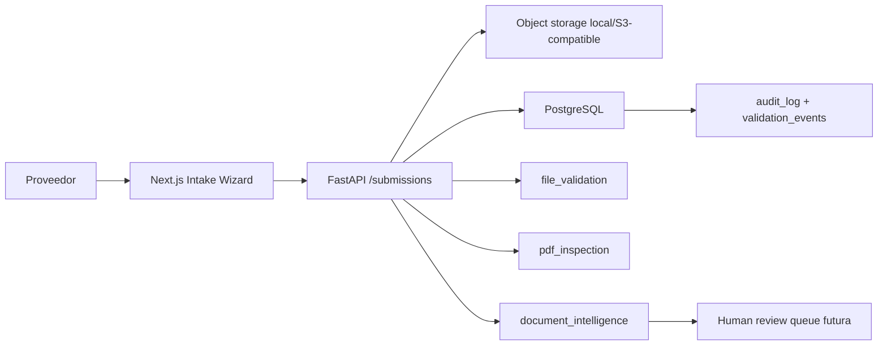

# Native Intake Architecture

## Decisión

CheckWise V1.1 convierte la carga documental en un flujo nativo de cumplimiento. El objetivo no es reemplazar toda la operación todavía, sino crear el primer intake propio que pueda absorber progresivamente lo que hoy hace JotForm.

## Flujo V1.1

## Capas

- `file_validation`: extensión, MIME, tamaño, archivo no vacío, hash, duplicado.
- `pdf_inspection`: cabecera PDF, corrupción, cifrado, páginas, texto legible, PDF escaneado.
- `document_intelligence`: señales determinísticas como institución, tipo documental, RFCs, fechas, periodo probable y posible mismatch.
- `human_review_queue`: futura cola interna para dictamen legal/fiscal.

## Contrato Preservado

`POST /api/v1/submissions` se mantiene. La respuesta se extendió con:

- `inspection`
- `document_signals`
- `validation_events`
- `support`

Esto evita romper el cliente actual y permite que el wizard muestre resultados más ricos.

## Estados

El estado inicial normal sigue siendo `pendiente_revision`. V1.1 agrega `posible_mismatch` para documentos que se reciben y conservan, pero presentan señales determinísticas de no coincidir con requisito/institución. PDFs corruptos o bloqueados pasan a `requiere_aclaracion`.

## No Aprobación Automática

Ninguna señal de V1.1 aprueba legalmente un documento. El sistema solo preclasifica riesgos y registra evidencia para revisión humana.
